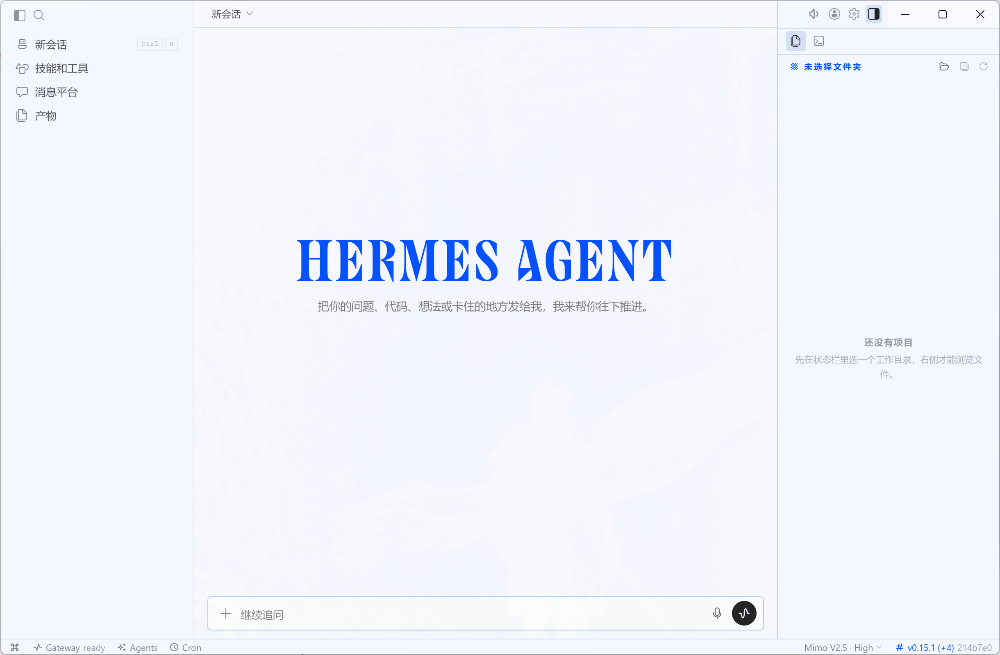
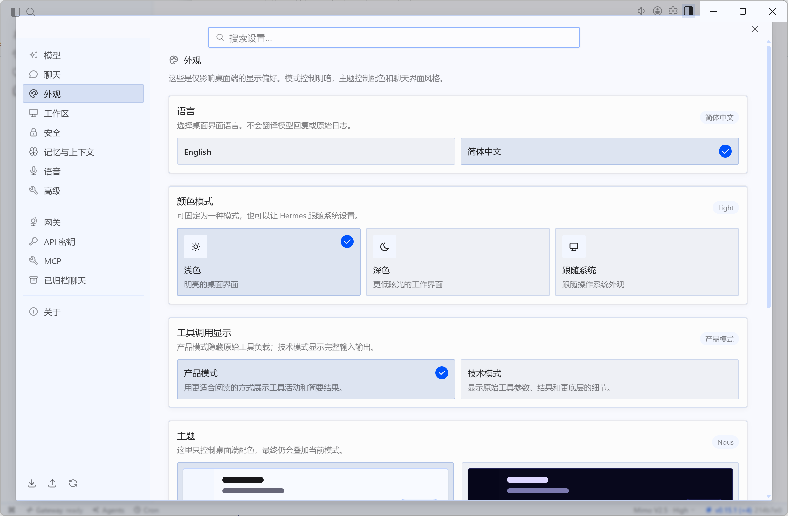

# Hermes Desktop 简体中文补丁

给 `Hermes Agent` Windows 桌面版准备的简体中文补丁仓库。

这个仓库不是官方完整源码，也不是整仓 fork。它只保留了这次汉化真正需要的文件，目标很明确：

- 给 Hermes Desktop 补上简体中文界面
- 支持中英切换
- 支持更新后“一键重新打回中文”

适合这类用户：

- 已经装好了 Windows 版 Hermes Desktop
- 想把桌面界面改成简体中文
- 不想每次更新后重新手工改文件

## 现在能做什么

目前这套补丁已经覆盖了桌面端的大部分高频界面，包括：

- 设置页和语言切换入口
- 首次安装页
- 首次登录引导
- 更新弹窗
- 首页欢迎文案
- 左侧主导航
- 技能与工具页
- 消息平台页
- 产物页
- MCP / API 密钥 / 网关 / 关于页
- 右侧文件区、搜索区、会话菜单、部分弹窗

说明一下：

- **模型名**
- **厂商名**
- **日志原文**

这些内容大多保留英文，这是故意的。这样排障时不容易和官方文档对不上。

## 仓库结构

- `apps/desktop/src/...`
  这次汉化需要覆盖的桌面端文件
- `scripts/reapply-desktop-zh.ps1`
  把本仓库里的汉化文件同步到 Windows 版 Hermes，并重新打包
- `scripts/update-desktop-zh.ps1`
  先更新 Windows 版 Hermes，再自动重新套用汉化
- `docs/desktop-zh-reapply.md`
  更详细的中文使用说明

## 使用前提

你需要先安装官方 Windows 版 Hermes Desktop。

默认安装目录通常是：

```text
%LOCALAPPDATA%\hermes\hermes-agent
```

## 快速开始

### 1. 获取这个补丁仓库

```powershell
git clone https://github.com/dgsxjhs/hermes-agent-zh-cn.git
cd hermes-agent-zh-cn
```

### 2. 首次套用汉化

```powershell
powershell -ExecutionPolicy Bypass -File .\scripts\reapply-desktop-zh.ps1
```

它会自动做这些事：

1. 关闭正在运行的 Hermes
2. 把本仓库里的汉化文件覆盖到 Windows 版 Hermes 安装目录
3. 自动跑类型检查
4. 自动重新打包桌面版
5. 自动重新打开 Hermes

### 3. Hermes 更新后重新打中文

如果官方桌面版更新后界面又变回英文，直接运行：

```powershell
powershell -ExecutionPolicy Bypass -File .\scripts\update-desktop-zh.ps1
```

它会自动做这些事：

1. 关闭正在运行的 Hermes
2. 暂存 Windows 安装目录里的本地改动
3. 拉取官方最新代码
4. 重新同步本仓库里的汉化文件
5. 自动类型检查、重新打包并重启 Hermes

## 常用参数

只检查汉化文件是否齐全，不打包：

```powershell
powershell -ExecutionPolicy Bypass -File .\scripts\reapply-desktop-zh.ps1 -CheckOnly
```

只同步文件，不重新打包：

```powershell
powershell -ExecutionPolicy Bypass -File .\scripts\reapply-desktop-zh.ps1 -SkipBuild
```

打包但不自动打开 Hermes：

```powershell
powershell -ExecutionPolicy Bypass -File .\scripts\reapply-desktop-zh.ps1 -SkipLaunch
```

## 常见问题

### 1. 为什么更新后中文又没了

因为这不是官方内置中文，而是本地补丁。  
官方桌面版一更新，原文件可能会被覆盖，所以需要重新跑：

```powershell
powershell -ExecutionPolicy Bypass -File .\scripts\update-desktop-zh.ps1
```

### 2. 为什么 About 页面还是旧版本号

有时桌面端右下角或 About 页显示的是静态版本号，但下面的提交号已经变了。  
简单理解就是：

- **版本号文本** 可能没跟着更新
- **实际代码提交** 已经更新了

所以判断是否真的更新成功，最好结合：

- 当前提交号
- 更新提示
- 实际功能是否已变更

### 3. 为什么有些地方还是英文

这套补丁已经覆盖了大部分常用区域，但 Hermes 官方后续一直在变，难免会有漏网之鱼。  
如果你发现明显漏掉的英文界面，欢迎提 issue 或自己补一版再提 PR。

## 界面预览

下面这两类界面，是这套补丁目前最直观的效果：

### 1. 首页汉化

- 左侧主导航已汉化
- 欢迎文案已汉化
- 右侧文件区空状态已汉化



### 2. 设置页汉化 + 语言切换

- `Appearance / 外观` 页面已补上语言切换入口
- 支持 `English / 简体中文`
- 常用设置分组和说明文案已大面积汉化



推荐后续继续补的截图包括：

- 技能页
- 消息平台页
- 更新弹窗

## 版权和来源

本仓库基于 Hermes 官方项目的桌面端源码改动而来，只保留汉化补丁所需文件。

Hermes Agent 官方项目：

- [NousResearch/hermes-agent](https://github.com/NousResearch/hermes-agent)

官方项目使用 MIT 许可证，本仓库也沿用 MIT。
